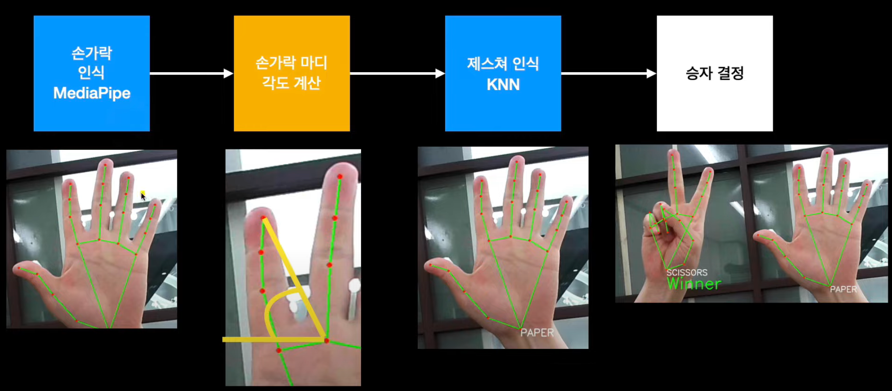
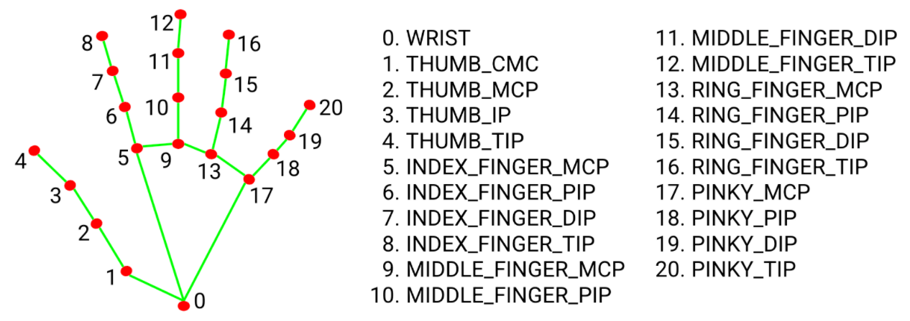

# Rock-Paper-Scissors Machine
AI fingers gesture detection with MediaPipe and KNN

---
### Goal
MediaPipe hands 모델을 사용해서 가위바위보 기계 만들기

### Run
- 1개의 손(제스처) 인식  
  Recognize single finger's gesture
    ```
    single.py
    ```
- 2개의 손을 인식해서 승자를 결정  
Recognize dual finger's gesture and determine the winner
    ```
    dual.py
    ```
- 제스처 인식이 잘 안되는 문제를 해결하기 위해 학습 데이터셋 추가
    ```
    gather_dataset.py
    ```

### Dependency
1. Python 3
2. OpenCV: Webcam control
3. MediaPipe

### Model
KNN(K-Nearest Neighbors)

### Data
1. 제스처 학습 데이터셋 (gesture_train.csv)
2. 인식이 잘 안되는 제스처를 추가한 데이터셋 (gesture_train_scissors.csv)

### Study
- 작동 원리
   


- [MediaPipe?](https://mediapipe.dev/)
  

- [MediaPipe hands model](https://google.github.io/mediapipe/solutions/hands.html#hand-landmark-model)

  hand landmark


- KNN (K-Nearest Neighbor)  
  특징 공간에서 테스트 데이터와 가장 가까이 있는 k개의 학습 데이터를 찾아 분류 또는 회귀를 수행하는 지도 학습 알고리즘

### Level up
1. label=2의 제스처(two)가 잘 인식되지 않음. 학습을 더 시켜서 성능향상시키기  
   -> `gather_dataset.py`를 실행시켜서 lebel이 2인 제스처 데이터셋 추가  
   -> `gesture_train_scissors.csv`에 저장하고, 이 데이터로 학습하는 `single.py`, `dual.py` 코드실행  
   -> 인식 정확도 향상된 것을 확인 😊

### Reference
1. [`빵형의 개발도상국`님의 유튜브 영상](https://www.youtube.com/watch?v=udeQhZHx-00)
2. [`kairess`님의 github](https://github.com/kairess/Rock-Paper-Scissors-Machine)
