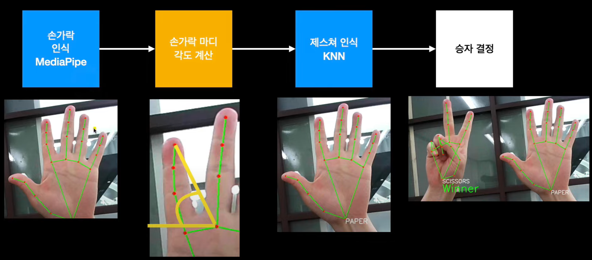

# Rock-Paper-Scissors Machine
AI finger gesture detection with MediaPipe and KNN

---
### Goal
MediaPipe hands 모델을 사용해서 가위바위보 기계 만들기

# Run
- 1개의 손(제스처) 인식  
  Recognize single finger's gesture
```
single.py
```
- 2개의 손을 인식해서 승자를 결정  
Recognize dual finger's gesture and determine the winner
```
dual.py
```

### Dependency
1. Python 3
2. OpenCV: Webcam control
3. MediaPipe

### Model
1. 제스처 인식모델 (gesture_train.csv)
2. KNN(K-Nearest Neighbors)

### Data


### Study
- 기계 작동 원리


- MediaPipe hands model

- 

### Level up


### Reference
1. [`빵형의 개발도상국`님의 유튜브 영상](https://www.youtube.com/watch?v=udeQhZHx-00)
2. [`kairess`님의 github](https://github.com/kairess/Rock-Paper-Scissors-Machine)
