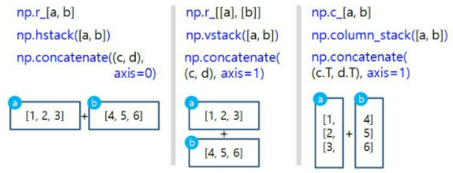
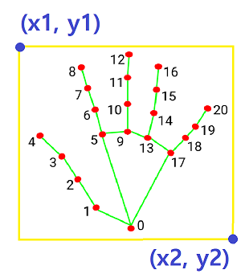

# Fxck You Filter
Mosaic the middle finger in video.

---
### Goal
영상에서 가운데 손가락 모자이크하기

### Dependency
1. Python 3
2. OpenCV
3. MediaPipe

### Model
KNN(K-Nearest Neighbors)

### Data
1. 제스처 학습 데이터 `data/gesture_train.csv`
2. fxck you 제스처 데이터가 추가된 데이터셋 `data/gesture_train_fy.csv`
3. 손하트 제스처 데이터가 추가된 데이터셋 `data/gesture_train_heart.csv`

### Run & Result
- fxck you 제스처(label=11)의 학습 데이터셋 추가
    ```
    gather_dataset.py
    ```
- fxck you 제스처를 인식해서 모자이크처리 => [`output_fy_filter.jpg`](https://github.com/koalalovepabro/KaggleStudy/blob/master/TP_03_Fxck%20You%20Filter/output/output_fy_filter.jpg)
    ```
    fy_filter.py
    ```
- 손하트 제스처(label=12)의 학습 데이터셋 추가
    ```
    gather_heart.py
    ```
- 손하트 제스처를 인식해서 텍스트와 바운딩박스 표시 => [`output_heart_filter.jpg`](https://github.com/koalalovepabro/KaggleStudy/blob/master/TP_03_Fxck%20You%20Filter/output/output_heart_filter.jpg)
    ```
    heart_filter.py
    ```

### Study
1. 배열 붙이기
    ```python
    # 클릭했을때 실행할 함수
    # 클릭했을 때 현재 각도 data를 원본 file에 추가
    def click(event, x, y, flags, param):
    global data, file
    if event == cv2.EVENT_LBUTTONDOWN:
        file = np.vstack((file, data))
        print(file.shape)
    ```
    <br><br>
   1. 두 배열을 왼쪽에서 오른쪽으로 붙이기
   ```python
   np.r_[a,b]
   np.hstack([a,b])
   np.concatenate((a,b), axis=0)
   ```
   2. 두 배열을 위에서 아래로 붙이기
   ```python
   np.r_[[a], [b]]
   np.vstack([a,b])
   np.concatenate((c,d), axis=1)  # for 2D ~ array
    ```
   3. 두 개의 1차원 배열을 칼럼으로 세로로 붙여서 2차워 배열 만들기
   ```python
   np.c_[a,b]
   np.column_stack([a,b])
   np.concatenate((c.T, d.T), axis=1) # for 2D ~ array
    ```
3. [사각형 그리기](https://m.blog.naver.com/PostView.naver?isHttpsRedirect=true&blogId=pk3152&logNo=221442217481)  
    ```python
    cv2.rectangle(img, pt1=(x1, y1), pt2 = (x2, y2), color=255, thickness=2)
    ```
    

3. 모자이크 처리의 원리  
    -> 모자이크를 적용할 관심 영역의 이미지를 특정 비율로 축소시킨 후 다시 확대  
    -> 크기가 작은 이미지를 최대 픽셀 값 이상의 크기로 확대하면 이미지가 깨지는 원리를 적용한 것.
    ```python
   # 이미지의 크기를 0.05배로 작게 만듦
   # 배율이 작아질수록 모자이크 픽셀의 크기가 커짐(더 큰 비율로 축소했다가 다시 확대하니 픽셀이 많이 깨짐)
   # 절대크기 인수(dsize): 축소 후 사이즈를 지정하지 않고 None을 설정
    fy_img = cv2.resize(fy_img, dsize=None, fx=0.05, fy=0.05, interpolation=cv2.INTER_NEAREST)
    
   # 작게 만들었던 이미지를 다시 원본 크기로 늘려줌
   # dsize: 축소 전의 원래 사이즈로 지정 (확대 후 사이즈. tuple(w,h))   
    fy_img = cv2.resize(fy_img, dsize=(x2 - x1, y2 - y1), interpolation=cv2.INTER_NEAREST)

    # 모자이크 처리된 이미지를 원본 이미지의 손 부분에 다시 붙여줌
    img[y1:y2, x1:x2] = fy_img
    ```
   -> interpolation (보간법)  
        : 알고 있는 데이터 값들을 이용하여 모르는 값을 추정하는 방법의 한 종류  

    |속성|의미|특징|
    |:---|:---|:---|
    |`cv2.INTER_NEAREST`|최근방 이웃 보간법|가장 빠르지만 ,퀄리티가 많이 떨어짐|
    |`cv2.INTER_LINEAR`|양선형 보간법<br>(2x2 이웃 픽셀 참조)|4개의 픽셀을 이용<br>효율성이 가장 좋으며 속도도 빠르고 퀄리티도 적당함|
    |`cv2.INTER_CUBIC`|3차회선 보간법<br>(4x4 이웃 픽셀 참조)|16개의 픽셀 이용<br>`cv2.INTER_LINEAR`보다 느리지만 퀄리티는 더 좋음   |
    |`cv2.INTER_LANCZOS4`|Lanczos 보간법<br>(8x8 이웃 픽셀 참조)|64개의 픽셀 이용<br>좀 더 복잡해서 오래 걸리지만, 퀄리티는 좋음|
    |`cv2.INTER_AREA`|영역 보간법|영역적인 정보를 추출해서 결과 영상을 셋팅<br>영상을 축소할 때 이용|

### Level up
1. 손하트 제스처 인식  
   -> `gather_heart.py`를 실행시켜서 손하트 제스처 데이터셋 추가  
   -> `gesture_train_heart.csv`에 저장하고, 이 데이터로 학습하는 `heart_filter.py` 코드실행  
   -> 손하트 제스처 인식되는것을 확인 [💗](https://github.com/koalalovepabro/KaggleStudy/blob/master/TP_03_Fxck%20You%20Filter/output/output_heart_filter.jpg)

### Reference
1. [`빵형의 개발도상국`님의 유튜브 영상](https://www.youtube.com/watch?v=tQeuPrX821w&list=PL-xmlFOn6TUJ9KjFo0VsM3BI9yrCxTnAz)
2. [`kairess`님의 github](https://github.com/kairess/Rock-Paper-Scissors-Machine)
