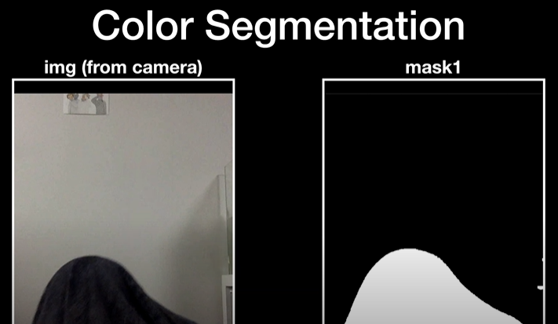
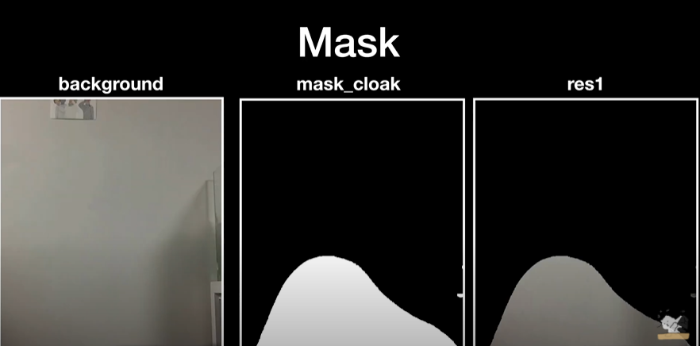
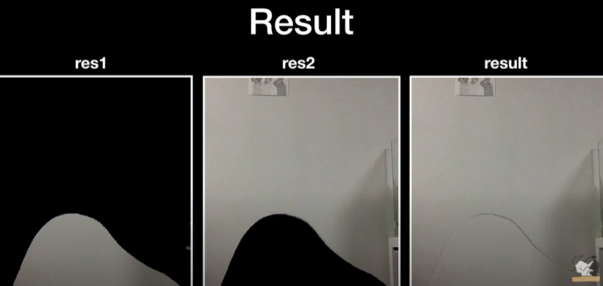
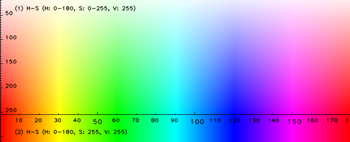

# Harry Potter Invisibility Cloak
Make Invisibility cloak using OpenCV

---
### Goal
해리포터 투명망토 만들기

### Dependency
1. Python 3
2. OpenCV
3. Numpy
4. MediaPipe

### Run
빨간색 컬러의 영역을 마스킹해서 그 영역만 투명하게 처리  => [`result.jpg`](https://github.com/koalalovepabro/KaggleStudy/blob/master/TP_04_Harry%20Potter%20Invisibility%20Cloak/output/result.jpg)
```python
main.py
```
투명인간 만들기 => [`result_levelup01.jpg`](https://github.com/koalalovepabro/KaggleStudy/blob/master/TP_04_Harry%20Potter%20Invisibility%20Cloak/output/result_levelup_01.jpg)
```python
levelup_01.py
```
손으로 하트 제스처를 취했을때만 투명인간 만들기  => [`result_levelup02.jpg`](https://github.com/koalalovepabro/KaggleStudy/blob/master/TP_04_Harry%20Potter%20Invisibility%20Cloak/output/result_levelup_02.jpg)
```python
levelup_02.py
```

### Result
`main.py` 실행 결과 이미지

|속성|이미지 파일명|
|:---|:---|
|웹캠 원본 이미지|[`original.jpg`](https://github.com/koalalovepabro/KaggleStudy/blob/master/TP_04_Harry%20Potter%20Invisibility%20Cloak/output/original.jpg)|
|빨간색 영역만 뽑아서 흰색으로 표시|[`mask_cloack`](https://github.com/koalalovepabro/KaggleStudy/blob/master/TP_04_Harry%20Potter%20Invisibility%20Cloak/output/mask_cloack.jpg)|
|background에서 빨간색 영역만큼만 뽑은 것|[`res1`](https://github.com/koalalovepabro/KaggleStudy/blob/master/TP_04_Harry%20Potter%20Invisibility%20Cloak/output/res1.jpg)|
|웹캠상 이미지에서 빨간색 영역만 제외한 것|[`res2`](https://github.com/koalalovepabro/KaggleStudy/blob/master/TP_04_Harry%20Potter%20Invisibility%20Cloak/output/res2.jpg)|
|투명하게 처리한 결과 이미지|[`result`](https://github.com/koalalovepabro/KaggleStudy/blob/master/TP_04_Harry%20Potter%20Invisibility%20Cloak/output/result.jpg)|

### Study
1. 원리  
    1. Color Segmentation  (**특정 컬러를 뽑아서 Mask 만들기**)  
        안보이게 하려는 부분의 컬러를 뽑아내는 작업.  
        해당 컬러영역은 255 (mask1에서 흰색부분), 그 외 영역은 0값 (Mask1에서 검은색 부분)을 갖게 됨. ->[`mask1`](https://github.com/koalalovepabro/KaggleStudy/blob/master/TP_04_Harry%20Potter%20Invisibility%20Cloak/output/mask_cloack.jpg)
        
    2. Mask  
       **미리 저장해둔 background 이미지에 Mask 입히기 -> [`res1`](https://github.com/koalalovepabro/KaggleStudy/blob/master/TP_04_Harry%20Potter%20Invisibility%20Cloak/output/res1.jpg)**  
        
    3. Result  
        **웹캠 이미지에서 마스크만큼 빼기 -> [`res2`](https://github.com/koalalovepabro/KaggleStudy/blob/master/TP_04_Harry%20Potter%20Invisibility%20Cloak/output/res2.jpg)**  
        **그 둘을 합치기 -> [`res1`](https://github.com/koalalovepabro/KaggleStudy/blob/master/TP_04_Harry%20Potter%20Invisibility%20Cloak/output/res1.jpg) + [`res2`](https://github.com/koalalovepabro/KaggleStudy/blob/master/TP_04_Harry%20Potter%20Invisibility%20Cloak/output/res2.jpg) = [`result`](https://github.com/koalalovepabro/KaggleStudy/blob/master/TP_04_Harry%20Potter%20Invisibility%20Cloak/output/result.jpg)**
        

2. [argparse](https://docs.python.org/ko/3.7/library/argparse.html)  
     프로그램을 실행시에 커맨드 라인에 인수를 받아 처리를 간단히 할 수 있도록 하는 표준 라이브러리  
     ```python
    import argparse
   
    # 인자값을 받을 수 있는 인스턴스 생성
    parser = argparse.ArgumentParser()
   
    # 입력받을 인자값 등록
    parser.add_argument('--video', help='Input video path')
   
    # 입력받은 인자값을 args에 저장 (type: namespace)
    args = parser.parse_args()
    ```
3. HSV  

    |명칭|값의 범위|참고|
    |:---|:---|:---|
    |**H**<br>(Hue, 색상) |0 – 180|원래 0–360 범위지만 OpenCV에서는 1/2범위인 0–180|
    |**S**<br>(Saturation, 채도)|0 – 255|0에 가까울수록 white, 255에 가까울 수록 H의 색상이 됨|
    |**V**<br>(Value(Brightness), 밝기)|0 – 255|0에 가까울수록 black, 255에 가까울 수록 H의 색상이 됨|

- HSV color map  
 
  - **Red** falls between 0–60 degrees.  
  - **Yellow** falls between 61–120 degrees.  
  - **Green** falls between 121–180 degrees.  
  - **Cyan** falls between 181–240 degrees.  
  - **Blue** falls between 241–300 degrees.  
  - **Magenta** falls between 301–360 degrees.  
  ```python
   # 빨간색 마스크 만들기
   
   # 0 ~ 10 범위의 빨간색
  lower_red = np.array([0, 120, 70])
  upper_red = np.array([10, 255, 255])
  mask1 = cv2.inRange(hsv, lower_red, upper_red)

  # 170 ~ 180 범위의 빨간색
  lower_red = np.array([170, 120, 70])
  upper_red = np.array([180, 255, 255])
  mask2 = cv2.inRange(hsv, lower_red, upper_red)

  mask1 = mask1 + mask2
  ```
4. [노이즈 제거](https://docs.opencv.org/3.0-beta/doc/py_tutorials/py_imgproc/py_morphological_ops/py_morphological_ops.html)  
    1) `cv2.morphologyEx(img, cv2.MORPH_GRADIENT, kernel)`  
        노이즈 제거  
        <br><br>
    2) `cv2.dilate(img,kernel,iterations = 1)`  
        픽셀을 늘려줌. 이미지의 흰색 영역이 증가하거나 전경 객체의 크기가 커짐  
        
   
        ```python   
        mask_cloak = cv2.morphologyEx(mask1, op=cv2.MORPH_OPEN, kernel=np.ones((3, 3), np.uint8), iterations=2)
        mask_cloak = cv2.dilate(mask_cloak, kernel=np.ones((3, 3), np.uint8), iterations=1)
        mask_bg = cv2.bitwise_not(mask_cloak)
        cv2.imshow('mask_cloak', mask_cloak)
        ```
5. [이미지 합성](https://docs.opencv.org/2.4/modules/core/doc/operations_on_arrays.html?highlight=addweighted#addweighted)
   ```python
    result = cv2.addWeighted(src1=res1, alpha=1, src2=res2, beta=1, gamma=0)
    ```
6. [MediaPipe의 selfie_segmentation 솔루션](https://google.github.io/mediapipe/solutions/selfie_segmentation.html#models)  
    쉽게 배경을 분리시킬 수 있음

### Level up
1. 투명인간 만들기 ! ([`levelup_01.py`](https://github.com/koalalovepabro/KaggleStudy/blob/master/TP_04_Harry%20Potter%20Invisibility%20Cloak/levelup_01.py))  
   -> MediaPipe의 selfie_segmentation 솔루션을 사용하여 배경분리  
   -> 사람영역(배경이 아닌 영역)을 masking  
   -> masking 한 부분에 background 이미지 합성  
   -> 웹캠상 내 모습이 투명인간으로 변한 것을 확인 [💜](https://github.com/koalalovepabro/KaggleStudy/blob/master/TP_04_Harry%20Potter%20Invisibility%20Cloak/output/result_levelup_01.jpg) <br><br>

2. 특정 제스처를 취했을 때에만 투명인간으로 만들기! ([`levelup_02.py`](https://github.com/koalalovepabro/KaggleStudy/blob/master/TP_04_Harry%20Potter%20Invisibility%20Cloak/levelup_02.py))  
   -> MediaPipe의 Hands 솔루션과 knn 학습을 통해 손 제스처 인식  
   -> MediaPipe의 selfie_segmentation 솔루션을 사용하여 배경분리  
   -> 손으로 하트 제스처를 취했을때만 사람영역(배경이 아닌 영역)을 masking 하고 background 이미지 합성  
   -> 웹캠상 내 모습이 투명인간으로 변한 것을 확인 [💗](https://github.com/koalalovepabro/KaggleStudy/blob/master/TP_04_Harry%20Potter%20Invisibility%20Cloak/output/result_levelup_02.jpg) <br>

### Reference
1. [`빵형의 개발도상국`님의 유튜브 영상](https://www.youtube.com/watch?v=suytB_6aS6M)
2. [`kairess`님의 github](https://github.com/kairess/invisibility_cloak)
