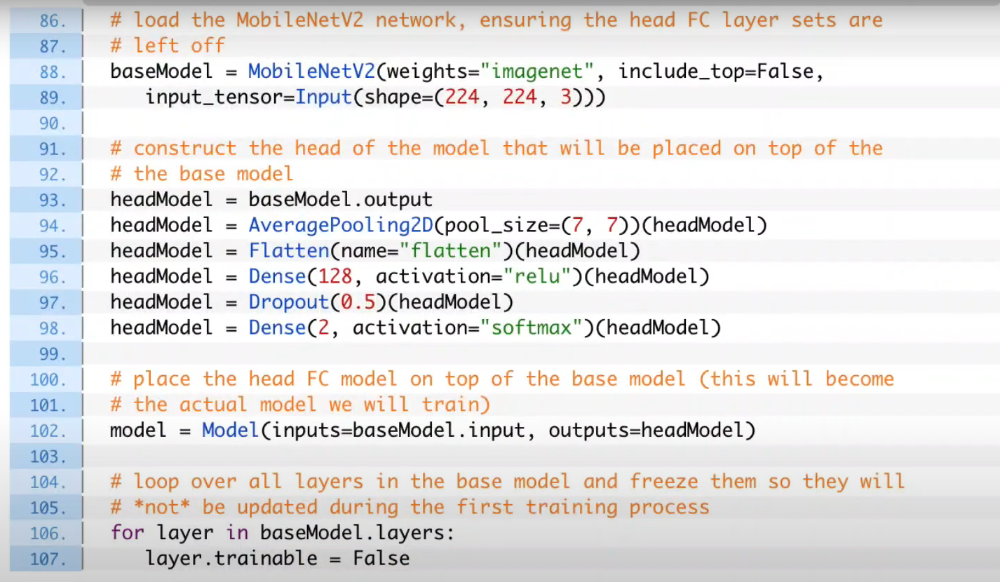

# Face Mask Detection
Face and mask detector using CNN

---
### Goal
CNN을 사용하여 마스크 착용여부 알아내기

### Dependency
1. Python 3
2. TensorFlow 2+
3. OpenCV
4. numpy
5. matplotlib

### Model
MobileNetV2

### Dataset
1. [COVID-19: Face Mask Detector with OpenCV, Keras/TensorFlow, and Deep Learning](https://www.pyimagesearch.com/2020/05/04/covid-19-face-mask-detector-with-opencv-keras-tensorflow-and-deep-learning/)


### Run & Result
- Image 넣어서 예측  => [`output_img3.png`](https://github.com/koalalovepabro/KaggleStudy/blob/master/TP_06_COVID-19%20Face%20Mask%20Detection/result/output_img3.png)
    ```
    image.ipynb
    ```
- Video 또는 웹캠 화면상에서 예측  => [`output_img2`](https://github.com/koalalovepabro/KaggleStudy/blob/master/TP_06_COVID-19%20Face%20Mask%20Detection/result/output_img2.jpg)
    ```
    video.py
    ```
### Study
1. Face Mask Detector with OpenCV, Keras/TensorFlow, and depp Learning  
**모델의 구조 살펴보기**  

   - MobileNetV2를 전이학습(Transfer Learning)
   - 기존 모델의 top부분을 없앤 후, layer 쌓아주기
   - 마지막 layer 2개: 활성화함수로 softmax를 사용하여 마스크를 쓴 확률과 쓰지 않은 확률을 나타냄
     - 마스크를 썼을 때  -> [1, 0]
     - 마스크를 안썼을 때  -> [0, 1] <br><br>

   
   - cross entropy를 사용하여 학습시킴 <br><br>

   
   - 학습 후 test dataset 넣어서 예측
   
### Reference
1. [`빵형의 개발도상국`님의 유튜브 영상](https://www.youtube.com/watch?v=ncIyy1doSJ8&t=503s)
2. [`kairess`님의 github](https://github.com/kairess/mask-detection.git)
